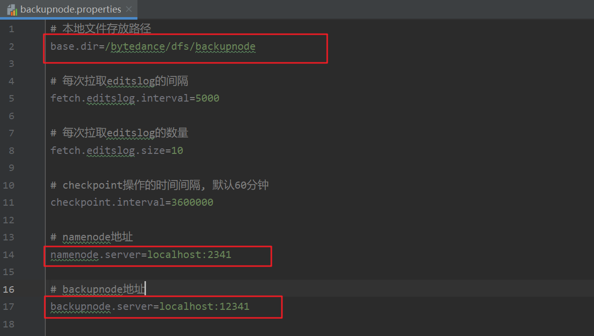

# 项目介绍 #

# 项目架构 #

# 编译&运行 #

## 初始化 ##

## 启动NameNode ##

## 启动BackupNode ##
BackupNode启动类为：`hdfs-backupnode/src/main/java/com/bytetenns/backupnode/BackupNode.java`    

BackupNode启动前需要修改配置文件，设置本地文件存储路径和backupNode的启动地址端口，添加nameNode的地址端口：  


启动参数配置如下`conf/backupnode.config`：  


## 启动DataNode ##

## 运行客户端和单元测试 ##
Client启动需要配置输入参数，比如在vscode的.vscode/launch.json需要有

```
        {
            "type": "java",
            "name": "Launch DfsCommand",
            "request": "launch",
            "mainClass": "com.bytetenns.client.tools.DfsCommand",
            "projectName": "hdfs-client",
            "args": ["-port=2345", "-secret=123456", "-server=localhost", "-username=root"]
        }
```
